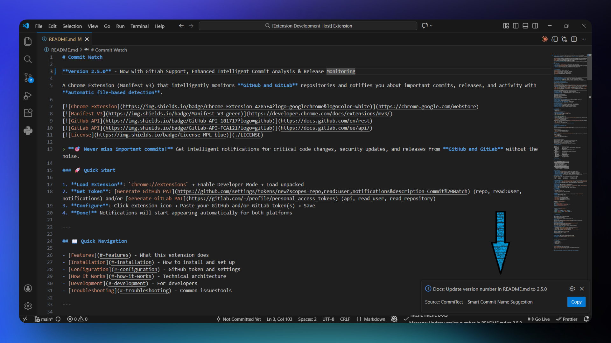

# Commit Intent Detector

Automatically detect the intent of your code changes when saving files. This extension analyzes git diffs and predicts whether your changes represent a bug fix, new feature, refactor, risky commit, or documentation update.


## Screenshots

### Intent Detection Notification

*Real-time notification appears after saving a file*

## Features

**Automatic Intent Detection**
- Analyzes git diffs in real-time as you save files
- Predicts commit type: Bug Fix, Feature, Refactor, Risky Commit, or Documentation

**Smart & Fast**
- Debounced saves prevent excessive API calls
- Automatically skips binary files and ignored directories
- Works only in git repositories with tracked files

## Requirements

- VS Code 1.107.0 or higher
- Git repository (extension only works in git repos)
- Backend API endpoint running (configurable)

## Installation

1. Open VS Code
2. Go to Extensions (`Ctrl+Shift+X`)
3. Search for "Commit Intent Detector"
4. Click Install

## Extension Settings

Configure in VS Code settings (`File > Preferences > Settings`):

* `commitIntentDetector.enabled` - Enable/disable the extension (default: `true`)
* `commitIntentDetector.apiUrl` - Backend API endpoint (default: `https://localhost:7183/api/Commit/analyze`)
* `commitIntentDetector.timeout` - API request timeout in ms (default: `30000`)
* `commitIntentDetector.debounceDelay` - Delay before processing saves in ms (default: `1000`)
* `commitIntentDetector.showStatusBar` - Show status bar indicator (default: `true`)
* `commitIntentDetector.allowInsecureSSL` - Allow self-signed certificates for development (default: `false`)

## How to Use

1. Open a git repository in VS Code
2. Make changes to a tracked file
3. Save the file (`Ctrl+S` or `Cmd+S`)
4. See the detected commit intent in the notification

The extension works automatically - no commands needed!

## Backend API Setup

The extension requires a running backend API. Your API should accept this format:

**Request:**
```json
POST /api/Commit/analyze
{
  "diff": "+ // Added a new feature: subtraction support\n+ function subtract(a, b) {\n+   return a - b;\n+ }"
}
```

**Response:**
```json
{
    "intent": "Intent: Feature\nMessage: Add subtraction support to the calculator"
}
```

Supported intents: `Bug Fix`, `Feature`, `Refactor`, `Risky Commit`, `Documentation`, `Test`

## Troubleshooting

**No notifications appearing?**
- Make sure you're in a git repository
- Check that the file has tracked changes
- Verify `commitIntentDetector.enabled` is `true`

**SSL certificate errors?**
- For development: Enable `commitIntentDetector.allowInsecureSSL`
- For production: Use a valid SSL certificate

**API connection failed?**
- Verify the backend service is running
- Check `commitIntentDetector.apiUrl` is correct
- Test the endpoint manually

## Known Limitations

- Only works in git repositories
- Requires a running backend API
- Binary files are excluded
- Large diffs (>5MB) are skipped
- Untracked files are ignored

## Privacy

This extension sends git diff content to your configured backend API for analysis. No data is sent to third parties.

## Support

- Report issues: [GitHub Issues](https://github.com/Mohammed-3tef/Commit_Intent_Detector/issues)
- Source code: [GitHub Repository](https://github.com/Mohammed-3tef/Commit_Intent_Detector)

## License

MIT License - see [LICENSE](LICENSE) file for details

---

**Enjoy better commit awareness!** 🚀